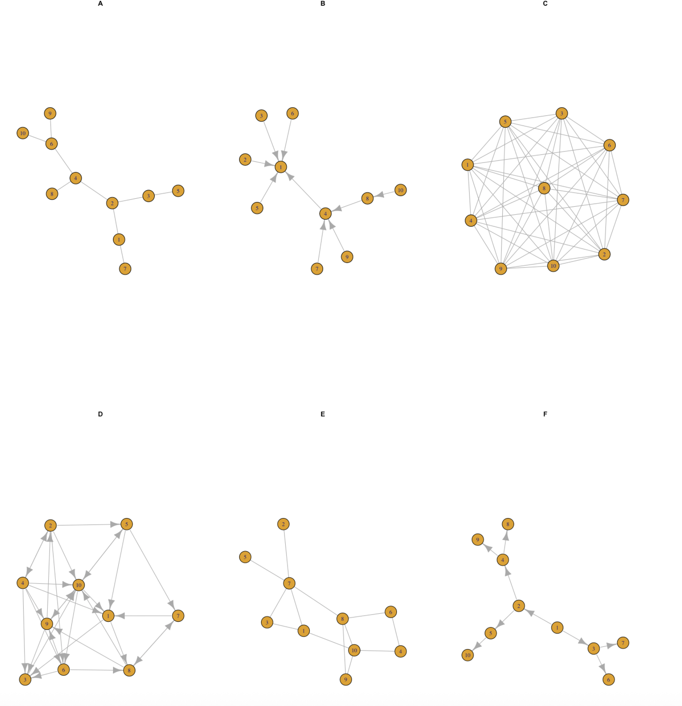

```{r setup, include=FALSE}
knitr::opts_chunk$set(echo = TRUE)
library(igraph)
```

# Tarea 4

## (20 %) Preguntas rápidas (simples)

1.  Considera una red de 15 nodos . Considera que tienes una sola conexión. ¿Cuál es el número máximo de nodos que puedes conectar? Dado un solo nodo , ¿cuál es el número máximo conexiones que puede tener tal nodo?

```{r}
# Numero de conexiones maximas
a <- (15*(15-1))/2
# Numero de conexiones maximas por nodo
b <- 15-1

c(a,b)
```

2.  Considera una red dirigida de 10 nodos. Usa 25 conexiones y dibuja una red con ese número de nodos y conexiones dirigidas. Calcula la distribución de conectividades de salida.Calcula el número total de conexiones de salida ¿Cómo se compara el número total de de conectividades de entrada (son iguales, diferentes)? Explica tu respuesta. Calcula el promedio de entrada y de salida. Discute tu resultado.

```{r}
# Red dirigida de 10 nodos
red_dir <- make_empty_graph(10, TRUE)

# Conexiones 
red_dir <- add_edges(red_dir, c(1,5, 1,6, 2,6, 2,3, 3,5, 3,8, 4,2, 4,9, 3,6, 5,2, 5,7, 5,3, 6,9, 6,7, 7,1, 7,4, 7,8, 8,1, 8,4, 9,10, 9,2, 9,7, 10,5, 10,7, 10,3))
 
plot(red_dir)
```

```{r}
# Distribucion de conexines de salida
out <- degree(red_dir, mode = "out")
hist(out, main='Conexiones de salida',breaks=15, col='violet')
```

```{r}
# Total de conexiones out e in
T_conex <- c(sum(out), sum(degree(red_dir, mode = "in")))
T_conex
```

Son iguales, debido a que las mismas conexiones que van de salida de los nodo son las mismas que van dirigas/entran a otros.

```{r}
# Promedio de in y out
promedios <- c(mean(out), mean(degree(red_dir, mode = "in")))
promedios
```

Este tambien resulta ser igual porque conserva la misma caracteristica y, por lo tanto, consideran excatamente la misma cantidad de conexiones.

3.  Considera una red no dirigida de $n=3,4,5,6$ nodos respectivamente. ¿Cuál es el número máximo de conexiones que puedes poner? Dibuja cada caso. ¿Qué pasa si la red es dirigida?

```{r}
# Redes NO dirigidas
nd3 <- make_full_graph(3, FALSE)
nd4 <- make_full_graph(4, FALSE)
nd5 <- make_full_graph(5, FALSE)
nd6 <- make_full_graph(6, FALSE)

# Conexiones maximas
c_max <- function(red){
  (components(red)$csize*(components(red)$csize-1))/2
}

# Lista de las redes
redes <- list(nd3=nd3, nd4=nd4, nd5=nd5, nd6=nd6)

# Dibujos
for (name in names(redes)) {
  cat("\nRed de", name, "\n")
  red <- redes[[name]]
  cat("\nNuero max. de conexiones:", c_max(red), "\n")
  plot(red, main= "Red NO dirigida")
}

```

```{r}
# Redes dirigidas
nd3_d <- make_full_graph(3, TRUE)
nd4_d <- make_full_graph(4, TRUE)
nd5_d <- make_full_graph(5, TRUE)
nd6_d <- make_full_graph(6, TRUE)

# Lista de las redes
redes_d <- list(nd3_d=nd3_d, nd4_d=nd4_d, nd5_d=nd5_d, nd6_d=nd6_d)

# Dibujos
for (name in names(redes_d)) {
  cat("\nRed de", name, "\n")
  red_d <- redes_d[[name]]
  plot(red_d, main= "Red dirigida")
}
```

No hay ninguna diferencia debido a que el numero de conexiones maximas sigue siendo la misma pues estas cuenta como una sola aun si solo van de salida o de entrada, ya que de cualquier manera unen o representan la interaccion entre un par especifico de nodos.

4.  Considera tu red de amigos reales. ¿Cuál es tu coeficiente de clusterización?

```{r}
amigos <-read.csv("tablas/matriz_amigos.csv")
rownames(amigos)<-amigos[,1]
amigos<-amigos[,-1]
amigos<-as.matrix(amigos)
diag(amigos)<-0
red_amigos <-graph_from_adjacency_matrix(amigos)

transitivity(red_amigos, type = "local")["TRINIDAD"]
```

## (80 % ) Scripts, código, texto y gráficas

1.  **Propiedades básicas de redes**

A partir de las siguientes redes calcula manualmente las siguientes propiedades de cada red {width="20cm" height="20cm"}

-   Número de conexiones
-   Número de nodos
-   Degree
-   Average degree
-   Degree distribution
-   Density
-   Adjacency matrix
-   Matriz de distancia
-   Diámetro
-   Nodos más distantes
-   Coeficiente de clusterización

¡[Resultados manuales](Imagenes)

Después escribe código en R que genere las gráficas de las redes y que calcule las propiedades anteriores para cada red.

```{r}
# Generacion de redes
redA <- make_empty_graph(10, FALSE)
redA <- add_edges(redA, c(10,6, 9,6, 6,4, 8,4, 4,2, 2,3, 3,5, 2,1, 1,7))

redB <- make_empty_graph(10, TRUE)
redB <- add_edges(redB, c(2,1, 3,1, 6,1, 5,1, 4,1, 10,8, 8,4, 9,4, 7,4))

redC <- make_full_graph(10, FALSE)

redD <- make_empty_graph(10, TRUE)
redD <- add_edges(redD, c(1,3, 1,8, 2,4, 2,6, 2,10, 2,5, 3,10, 4,2, 4,3, 4,6, 4,9, 4,10, 4,1, 5,10, 5,1, 5,7, 6,9, 6,3, 6,8, 7,8, 7,1, 8,7, 8,9, 8,10, 9,3, 9,10, 9,2, 10,9, 10,6, 10,1, 10,5))

redE <- make_empty_graph(10, FALSE)
redE <- add_edges(redE, c(5,7, 2,7, 3,7, 1,7, 8,7, 1,3, 6,8, 10,8, 10,1, 6,4, 4,10, 9,10, 9,8))

redF <- make_empty_graph(10, TRUE)
redF <- add_edges(redF, c(4,9, 4,8, 2,4, 2,5, 5,10, 1,2, 1,3, 3,6, 3,7))

# Lista de las redes
redes_AF <- list(redA=redA, redB=redB, redC=redC, redD=redD, redE=redE, redF=redF)

# Evaluacion de cada red

for (name in names(redes_AF)) {
  
  cat("\nImagen de la", name, "\n")
  red <- redes_AF[[name]]
  plot(red, main= name)
  
  cat("\nNúmero de conexiones:", gsize(red), "\n") 
  cat("\nNúmero de nodos:", gorder(red), "\n")
  cat("\nDegree local:", degree(red, mode = "total"), "\n") 
  cat("\nPromedio del degree:", mean(degree(red, mode = "total")), "\n")
  
  # Degree distribution
  dd <- degree_distribution(red)
  barplot(dd, main='Distribucion del degree', ylim = c(0:1), col='red', ylab = "Pk", xlab = "K")
  
  cat("\nDensidad:", edge_density(red), "\n")
  
  cat("\nMatriz de adyacencia de la", name, "\n")
  print(as_adjacency_matrix(red))
  
  cat("\nMatriz de distancias de la", name, "\n")
  print(distances(red))
  
  cat("\nDiámetro:", diameter(red), "\n") 
  # cat("\n", name, "\n") # Nodos más distantes
  cat("\nCoeficiente de clusterización local:", transitivity(red, type = "local"), "\n")
  cat("\nCoeficiente de clusterización", transitivity(red, type = "global" ), "\n")
  
}

```

1.  **Karate**

Considera la red del club de Karate de Zachary. [Acá](https://en.wikipedia.org/wiki/Zachary%27s_karate_club) puedes leer sobre eso. En igraph la gráfica está precargada

```{r message=FALSE, warning=FALSE}
karate <- make_graph("Zachary")
plot(karate)
```

-   ¿Cuántos nodos y conexiones tiene?
-   ¿Quiénes son los nodos y cuál es la regla de conexión?
-   ¿Qué tan densa es la red?
-   ¿Cómo obtienes la matriz de adyacencia?
-   ¿Es una red dirigida, pesada?
-   Calcula y gráfica la distribución de conectividades
-   Calcula el diámetro, la matriz de distancias y la distancia promedio
-   Encuentra la trayectoria de los nodos más alejados.
-   Existen nodos con coefeiciente de clusterización 1. ¿Qué significa?
-   Mide, con al menos tres medidas de centralidad, los nodos más importantes.

```{r}

cat("\nNúmero de conexiones:", gsize(karate), "\n") 
cat("\nNúmero de nodos:", gorder(karate), "\n")
# ¿Quiénes son los nodos y cuál es la regla de conexión?
cat("\nDensidad:", edge_density(karate), "\n")

cat("\nMatriz de adyacencia", "\n")
print(as_adjacency_matrix(karate))
  
cat("\nCalculo y grafico del degree", "\n")
dd <- degree_distribution(karate)
barplot(dd, main='Distribucion del degree', ylim = c(0:1), col='red', ylab = "Pk", xlab = "K")

cat("\nDiámetro:", diameter(karate), "\n")
cat("\nMatriz de distancias", "\n")
print(distances(karate))
cat("\nPromedio de la distancia:", mean_distance(karate), "\n")

cat("\nTrayectoria de los nodos mas alejados", "\n")
n_lejanos <- get_diameter(karate)
n_lejanos

cat("\nNodos con coefeiciente de clusterización de 1", "\n")
nd_1 <- which(transitivity(karate, type = "local") == 1)
nd_1


# IDENTIFICACION DE NODOS IMPORTANTES

# Propiedades de centralidad
# 1. Degree: numero de conexiones.
# 2. Betweenness: frecuencia con la que un nodo se encuentra en el camino más corto entre dos nodos en la red.
# Critico para el flujo de información. 
# 3. Closeness: promediao de la cercania/distancia de un nodo con respecto a todos los demas. El nodo con las distancias mas cortas es el más cercano

degree(karate)
betweenness(karate)
closeness(karate)

which(
  degree(karate) >= sort(degree(karate), decreasing = TRUE)[5] & 
    betweenness(karate) >= sort(betweenness(karate), decreasing = TRUE)[5] & 
    closeness(karate) >= sort(closeness(karate), decreasing = TRUE)[5]
)


```

-   ¿Cómo obtienes la matriz de adyacencia? Se realiza en base a la conexiones que tienen cada nodo con el resto. Para estos se usa una matriz binaria de 0 y 1, donde el 0 indica que na hay conexion y el 1 que si la hay.

-   ¿Es una red dirigida, pesada? No, es una red no dirigida por lo que tampoco es ponderada.

-   Existen nodos con coefeiciente de clusterización 1. ¿Qué significa? 
Que todos los nodos vecinos, respecto a un nodo, estan conectados entre si.

2.  **Amigues**

A partir de la red de amigues que vimos en clase, en su versión no ponderada, contesta lo siguiente:

-   Escribe una función que calcule el número de amigos que tiene cualquier persona arbitraria y lo compare con el número de los amigos de estos.

```{r}

num_amigos <- function(red, nombre){
  
  mis_amigos <- neighbors(red, nombre)
  lista <- vector('list', length(mis_amigos))
  
  for (x in 1:length(mis_amigos)) {
    lista[[x]] <- c(names(mis_amigos)[x], length(neighbors(red_amigos, names(mis_amigos)[x])))
  }
  
  lista[[length(mis_amigos)+1]] <- c(nombre, length(mis_amigos))
  print(lista)
}

num_amigos(red_amigos, "TRINIDAD") # Ej

```

-   Encuentra las dos personas más populares.

```{r}
# Personas más populares sin importar desde que perspectica se vea
sort(degree(red_amigos, mode = "total"), decreasing = TRUE)[1:2]

# Personas más populares segun si la gente los considera amigos
sort(degree(red_amigos, mode = "in"), decreasing = TRUE)[1:2]

#Personas que se consideran muy populares
sort(degree(red_amigos, mode = "out"), decreasing = TRUE)[1:2]


```

3.  **Red PPI**

A partir de la red de interacción proteína-proteína (PPI) de la levadura que se encuentra en la bilbioteca `igraphdata` Elabora un script que conteste lo siguiente:

-   Encuentre qué tipo de distribución de conectividades tiene. Haz un ajuste en log-log para ver que tipo de distribución podría ser.
-   Encuentra las diez proteínas más conectadas
-   Calcula el diámetro y promedio de las distancias
-   Crea una función que, a partir de eliminar al azar un noodo de la red genere el promedio d elas distancias después de eliminar $n=1,2,3,\ldots, 100$ nodos al azar
-   Crea una función que elimine las proteínas más conectadas y calcule el promedio de las distancias cad vez que se remueve un nodo.
-   Calcula el proemdio del coeficiente de clusterización. ¿Hay proteínas que tengan un coeficiente de clusterización de 1? Eso qué significa.
Todas las proteinas que interaccionan/conectan con una proteina en especifico al mismo tiempo tambien esas interaccionan entre si.

¡[Script del ejercicio 3](Scripts/red_ppi.R)

Discute tus resultados.
Bajo ninguno de los dos casos en los que se eliminaron nodos (por azar y de manera dirigida) el promedio de la distancia bajo sino más bien hubo un aumento en el promedio de la distancia, lo que indica que muchos de estos conectaban de manera más inmediata diferentes nodos, por lo que, al momento de eliminarlos la distancia entre esos aumento. 
Estos nodos son clave porque, justo como se ve en el grafico de distribución del degree, la mayoría de las proteínas interaccionan con diez proteínas mientras que son realmente muy pocas las que tienen una interacción simultanea con más de cien. Este mismo fenómeno se puede notar en la gráfica con ajuste logarítmico, donde la pendiente es negativa y la cantidad de nodos baja conforme aumenta el numero de conexiones.  


4.  **Redes biológicas**

Ve a al [Network Repository](https://networkrepository.com/bn-mouse-visual-cortex-1.php) y descarga la red en formato lista de adyacencia. Explica que representan los nodos y las conectividades.

Escribe código que resuelva lo siguiente:

-   Cargue y genere una gráfica en `igraph`.
-   Genera la gráfica con todos los layouts disponibles.
-   Grafica la red con al menos tres medidas de centralidad.

```{r}
library(igraph) # Cargar 

biolog <- read_graph("tablas/bn-mouse_visual-cortex_1/bn-mouse_visual-cortex_1.edges")# Formato de lista de adyacencia
plot(biolog)

# Gráfica en igraph con todos los layouts disp
plot(biolog, layout = layout.random, main = "Grafo 1") # Vértices de forma totalmente aleatoria
plot(biolog, layout = layout.circle, main = "Grafo 2") # Vertices en circulo
plot(biolog, layout = layout.sphere, main = "Grafo 3") # Vértices de manera uniforme en la superficie de una esfera
plot(biolog, layout = layout.drl, main = "Grafo 4") # Para redes grandes
plot(biolog, layout = layout_with_fr, main = "Grafo 5") # Algoritmo dirigido Fruchterman-Reingold
plot(biolog, layout = layout_with_kk, main = "Grafo 6") # Algoritmo dirigido Kamada-Kawai
plot(biolog, layout = layout_with_lgl, main = "Grafo 7") # Algoritmo para grafos grandes
plot(biolog, layout = layout_as_tree, main = "Grafo 8") # Diseño de árbol de Reingold-Tilford
plot(biolog, layout = layout_nicely, main = "Grafo 9") # Diseño de acuerdo a las propiedades de la red.


# Medidas de centralidad: medidas de la importancia de un nodo en una red
# Grafica
par(mfrow = c(2, 2))
hist(degree(biolog, mode = "total"), breaks=10, col="violet", main="Degree")
hist(betweenness(biolog), breaks=10, col="skyblue", main="Betweenness")
hist(closeness(biolog, mode = "total"), breaks=10, col="pink", main="Closeness")

```

```{r}
# Clusterizacion 
a <- transitivity(biolog, type = "global") # Global
a
b <- transitivity(biolog, type = "local" ) # Local
b
c <- transitivity(biolog, type = "undirected") # Undirected
c
```

5.  **Red de coexpresión simulada**

Simula una matriz de expresión con 20 genes en 6 condiciones diferentes.
```{r}
expresion <- matrix(nrow = 20, ncol = 6) # Matriz vacia
for (x in 1:20) { # Llenar matriz
  expresion[x,] <- cbind(c(sample(1:10, 6, replace = TRUE)))
}
colnames(expresion) <- c("T1", "T2", "T3", "T4", "T5", "T6")
rownames(expresion) <- c(1:20)
expresion
```
-   Calcula la correlación entre todos los pares de genes
-   Construye una red de coexpresión utilizando un umbral de correlación > 0.8.
-   Calcula la distribución de grados.
-   Identifica si hay módulos o agrupamientos de genes altamente correlacionados.
-   Visualiza la red y discute qué tipo de topología tiene.

```{r}
mat_cor <- as.matrix(cor(t(expresion))) # Correlacion entre par de genes
diag(mat_cor)<-0 # Quitar los pares de un gen

c8 <- which(mat_cor > 0.8, arr.ind = TRUE) # Par de genes
# Basado en https://github.com/jumanbar/Curso-R/blob/master/lecciones/manipular-tablas.R

red_c8 <- graph.adjlist(c8)
plot(red_c8)

dd_genes <- degree_distribution(red_c8) # Degree distribution
barplot(dd_genes, main='Distribucion del degree', ylim = c(0:1), col='red', ylab = "Pk", xlab = "K")

grupos <- cluster_label_prop(red_c8) # Detectar y visualizar grupos 
plot(grupos, red_c8,vertex.label.cex=.5) 

```

Segun la siguiente imagen y lo que se observa en el grafico realizado, supongo que es mas de tipo mixta ya que algunos nodos solo estan asociados con uno pero hay otros que se relacionan con mas de uno.  

6.  **Comparación de redes**

Construye dos redes:
-   Una red aleatoria tipo Erdos-Rényi.
-   Una red tipo "scale-free" usando el modelo Barabási–Albert.

Para ambas redes:
-   Compara su grado promedio, distribución de grados, coeficiente de clusterización y diámetro.

```{r}
erdos <- sample_gnp(20, 0.4)
barabasi <- sample_pa(20)

# Redes
par(mfrow = c(1, 2))
plot(erdos)
plot(barabasi)

# Degree promedio
print(paste("El promedo de la red1 es:", mean(degree(erdos)), "y el de la red2 es: ", mean(degree(barabasi))))

#Distribucion del degree
par(mfrow = c(1, 2))
hist(degree(erdos), breaks=10, col="violet", main="Red tipo E-R")
hist(degree(barabasi), breaks=10, col="pink", main= "Red tipo S-F")

# Coeficientes de clusterizacion
cat("\nCC local de la red tipo E-R:", "\n")
transitivity(erdos, type = "local") # CC local
cat("\nCC global de la red tipo E-R:", transitivity(erdos, type = "global" ), "\n") # CC global
 
cat("\nCC local de la red tipo S-F:", "\n")
transitivity(barabasi, type = "local") # CC local
cat("\nCC global de la red tipo S-F:", transitivity(barabasi, type = "global" ), "\n") # CC global

# Diametro / camino más largo
print(paste("El diametro de la red1 es:", diameter(erdos), "y el de la red2 es: ", diameter(barabasi)))

```

-   Interpreta las diferencias en el contexto de redes biológicas.

Lo que se puede observar entre ambas redes es que la de tipo S-F presenta un numero promedio de conexiones menor debido a que la mayoría de nodos tienen muy bajas conexiones y son pocos los que tienen muchas. En la red E-R la mayoría de los nodos presentan una gran cantidad de conexiones con diferentes nodos, es decir, que hay una cantidad de conexiones similares para cada nodo.  
En el caso de la red S-F la transitividad es de 0 mientras que en la red E-R es >0; lo que se debe a la baja conectividad que existe entre los nodos de la red de tipo S-F donde los puntos de mayor conexión son considerados hubs y sitios críticos/importantes en este tipo de matrices, en donde la eliminación de ese nodo central podría llevar a la fragmentación y/o deformación de la estructura de la red debido a la pérdida de un gran número de conexiones.
De manera general, lo que se ve es que la red E-R es más robusta que la S-F ya que la eliminación de nodos, independientemente si es dirigida o al azar, terminaría por no tener un impacto significativo en cuanto a las conexiones entre los demás nodos y la estructura general de la red.

